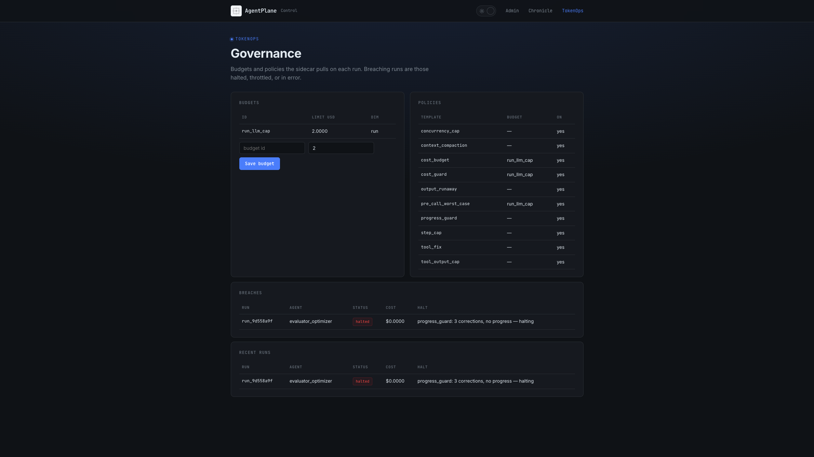
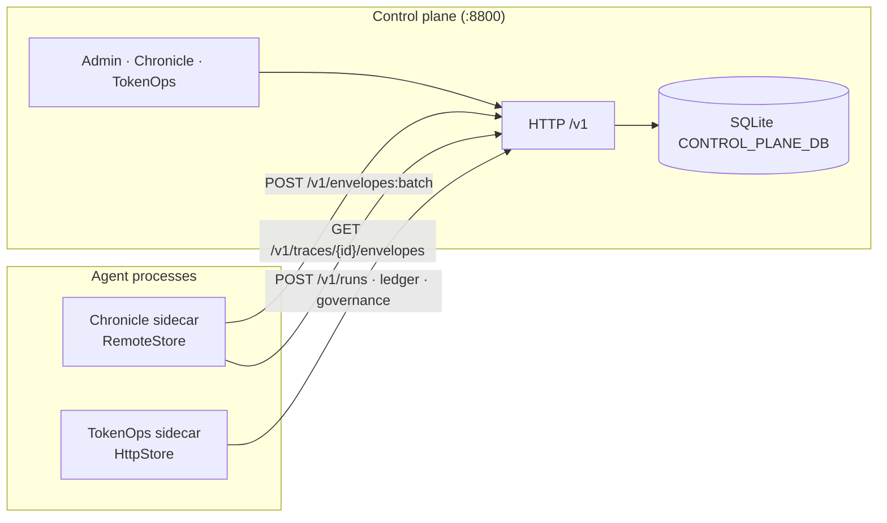
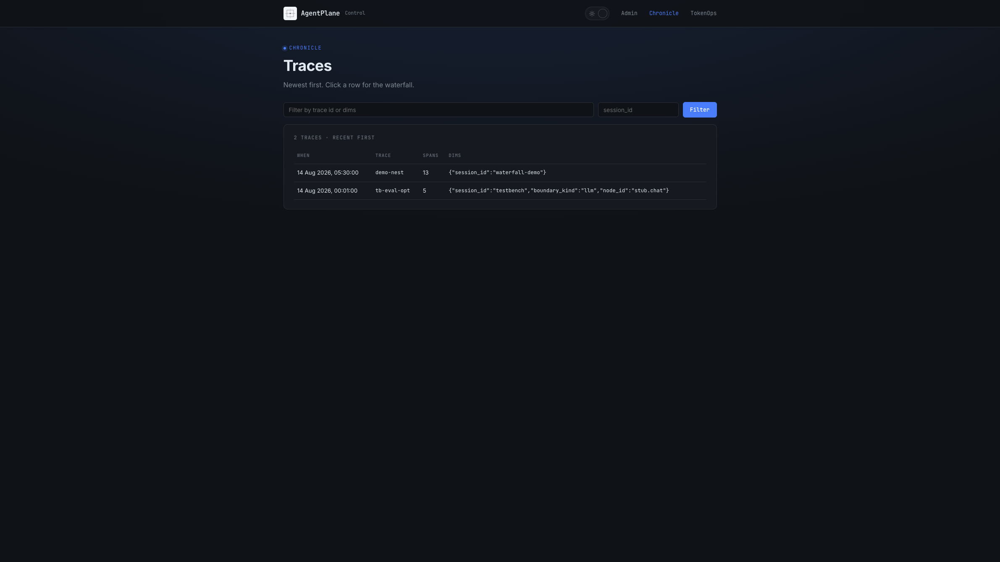

<div align="center">

# AgentPlane Control

**The shared control plane for agent traces and spend.**<br>
Chronicle and TokenOps talk HTTP. Only this process owns SQLite. Agents never open the database file.

[](https://github.com/theagentplane/control-plane/actions/workflows/ci.yml)
[](https://pypi.org/project/agentplane-control-plane/)
[](https://github.com/theagentplane/control-plane)
[](LICENSE)
[](https://semver.org/)
[](https://github.com/theagentplane/control-plane/stargazers)

<br>



<sub><i>One UI, one SQLite: budgets and policies on the left, a run halted in-path by <code>progress_guard</code> on the right. Chronicle traces live in the next tab.</i></sub>

</div>

<br>

AgentPlane Control is the **HTTP plane** Chronicle and TokenOps share. Sidecars post envelopes and register runs; the plane stores them; Admin, Chronicle, and TokenOps tabs read the same file. No NFS, no two processes fighting over WAL, no "which DB did that agent open."

**[Why](#why-agentplane-control) · [Architecture](#architecture) · [Install](#install) · [Quick start](#quick-start) · [Sidecars](#sidecars) · [Comparison](#how-it-compares) · [Design](docs/DESIGN.md)**

## Why AgentPlane Control

- **SQLite lives here. Nowhere else.** Chronicle and TokenOps are HTTP clients. They never receive a DB path.
- **One pane for both products.** Admin keys, Chronicle waterfalls, TokenOps budgets / policies / breaches — same process, same file.
- **Ingest is a contract, not a dump.** Chronicle writes `POST /v1/envelopes:batch` (`batch_size=1` = flush now) and replays `GET /v1/traces/{id}/envelopes`. TokenOps registers runs, ledger, and governance over `/v1/*`.
- **Auth when you need it.** Empty key table = local anonymous (all scopes, tenant `local`). Create sidecar keys in Admin, or seed `CONTROL_PLANE_API_KEYS`.
- **pip in, serve, done.** No Postgres, no login screen, no separate dashboard server.

## Architecture

The plane is one FastAPI process. Agents stay agents.



| Piece | Owns | Does not own |
|---|---|---|
| **This plane** (`control-plane serve`) | SQLite, HTTP API, HTML UI | Agent loops, LLM calls, record-and-replay, in-path halt |
| **[Chronicle](https://github.com/theagentplane/chronicle)** sidecar | Boundaries, envelopes, fixtures | The database file |
| **[TokenOps](https://github.com/theagentplane/tokenops)** sidecar | `tokenops_run`, `wrap_complete`, ledger client | The database file |

Design notes: [`docs/DESIGN.md`](docs/DESIGN.md).



<sub><i>Chronicle tab: newest traces first. Click a row for the time-based waterfall.</i></sub>

## Install

```bash
pip install agentplane-control-plane
```

**Prerequisites:** Python 3.10+. Sidecars are separate packages: `agent-chronicle>=0.4.0`, `agent-tokenops>=0.2.0`.

PyPI name is `agentplane-control-plane`; import is `control_plane`; CLI is `control-plane`.
See [`RELEASING.md`](RELEASING.md) for releases.

From a clone:

```bash
python -m venv .venv && source .venv/bin/activate
pip install -e ".[dev]"
```

## Quick start

```bash
control-plane serve --port 8800 --db control_plane.db
```

Open [http://127.0.0.1:8800/](http://127.0.0.1:8800/) — Admin, Chronicle, TokenOps. No login.

`control-plane ui` is a pointer, not a second server: the HTML UI is served with the API.

## Sidecars

Point both libraries at the same origin. Do **not** set a SQLite path on the agents.

```bash
export CONTROL_PLANE_URL=http://127.0.0.1:8800
# TokenOps also honors TOKENOPS_URL; leave TOKENOPS_EMBEDDED unset
```

**Chronicle** — flush every envelope to the plane:

```python
import os
import chronicle
from chronicle import RemoteStore

store = RemoteStore(os.environ["CONTROL_PLANE_URL"], batch_size=1)
with chronicle.record("my-run", store=store):
    ...
```

**TokenOps** — register runs and share the ledger over HTTP:

```python
from tokenops import ControlPlaneClient, tokenops_run

client = ControlPlaneClient.from_env()  # CONTROL_PLANE_URL or TOKENOPS_URL
with tokenops_run(client=client) as bound:
    ...
```

Auth off until you create a key. Then:

```bash
export CONTROL_PLANE_API_KEYS='chron:local:ingest+read,tops:local:ingest+read,admin:local:read+admin'
export CONTROL_PLANE_API_KEY=chron   # Chronicle / TokenOps sidecar
```

Or create keys in the Admin tab (secret shown once).

## API callers

Every route has one caller class. Agents do not scrape the UI.

| Route | Caller |
|---|---|
| `POST /v1/envelopes:batch` | Chronicle sidecar (only ingest API) |
| `GET /v1/traces/{id}/envelopes` | Chronicle sidecar (fixture replay) and Chronicle waterfall |
| `GET /v1/traces` | Chronicle UI search |
| `POST /v1/runs`, ledger, governance, run-records | TokenOps sidecar |
| segments / budgets / policies, admin keys | UI |

## How it compares

This is not a gateway, not a SaaS, and not a replacement for Chronicle or TokenOps. It is the **shared store + UI** those two already assume.

| | AgentPlane Control | TokenOps embedded SQLite | Langfuse / Phoenix |
|---|:---:|:---:|:---:|
| Primary focus | Shared plane (traces + spend) | Governance in one process | Observe / traces |
| Agents open the DB file | No | Yes (same `TOKENOPS_DB`) | N/A (hosted or collector) |
| Chronicle + TokenOps one UI | Yes | TokenOps UI only | No |
| In-path halt / mutate | Via TokenOps sidecar | Yes | No (analytics) |
| Record-and-replay fixtures | Via Chronicle sidecar | No | No |
| Requires hosted SaaS | No | No | Often |

What this does **not** do: call models, wrap `complete`, record boundaries, or host a multi-tenant cloud for you. Fail-closed auth is opt-in (create keys). The HTTP contract is still 0.x.

## Environment variables

<details>
<summary>Command and env reference</summary>

| Variable | Purpose |
|---|---|
| `CONTROL_PLANE_DB` | SQLite path (or `control-plane serve --db`) |
| `CONTROL_PLANE_URL` | Sidecar base URL (`http://127.0.0.1:8800`) |
| `CONTROL_PLANE_API_KEYS` | Seed keys: `name:tenant:scope+scope` |
| `CONTROL_PLANE_API_KEY` | Bearer the sidecar sends |
| `CONTROL_PLANE_CONFIG` | Governance YAML seed (else packaged `default.yaml`) |
| `TOKENOPS_URL` | TokenOps alias for the same origin |
| `TOKENOPS_API_KEY` | TokenOps alias for the Bearer |
| `TOKENOPS_EMBEDDED` | Must be **unset** when using this plane |

```
control-plane serve [--host 127.0.0.1] [--port 8800] [--db PATH] [--reload]
```

</details>

## Roadmap

The plane is early (0.x). Near-term:

- Harden SQLite under concurrent sidecar writes (`busy_timeout`, WAL discipline).
- Admin: persist the browser key so a refresh does not 401.
- Keep the HTTP contract stable enough for Chronicle 0.4 and TokenOps 0.2.

Ideas welcome via GitHub issues.

## Compatibility

| agentplane-control-plane | tokenops | agent-chronicle | notes |
|---|---|---|---|
| 0.1.x | ≤ 0.2.1 | ≥ 0.3.0 | single-op `/v1/ledger/*`, `PUT /v1/run-records` |
| **0.2.x** | ≤ 0.2.1 **and** `<next>` | ≥ 0.3.0 | **additive** — old clients keep working; adds `precheck` / `events:batch`, `run_state`, `data_scope` |
| 0.3.x | `<next>`+ only | ≥ 0.3.0 | breaking — drops `run_registrations`, `PUT /v1/run-records`, legacy ledger wrappers |

### Breaking changes

- **0.2.0 → 0.3.0:** `run_registrations` folded into `runs` and dropped;
  `PUT /v1/run-records` (`create_run`) removed; `PATCH /v1/run-records` rejects
  `steps` / `cost_micros` (0.2.x only ignores them); legacy `/v1/ledger/halt/*` and
  single-op `/v1/ledger/{spent,inflight}/*` writes removed. Runs as an automatic
  `PRAGMA user_version` v3 migration. Released only after `tokenops <next>` stops
  calling `create_run`.

Full contract: [`docs/api-contract.md`](docs/api-contract.md).

## Documentation

- [API contract](docs/api-contract.md) — the TokenOps ⇄ control-plane wire spec
- [Design](docs/DESIGN.md) — storage, callers, scopes, keys
- [Releasing](RELEASING.md) — Trusted Publishing to PyPI
- [Changelog](CHANGELOG.md)
- [Chronicle](https://github.com/theagentplane/chronicle) · [TokenOps](https://github.com/theagentplane/tokenops)

## Contributing

Issues and PRs are welcome.

```bash
pip install -e ".[dev]"
ruff check control_plane tests
pytest -v
```

## Contributors

Thanks to everyone who has contributed.

[](https://github.com/theagentplane/control-plane/graphs/contributors)

---

If this is the missing box between your agents and the database, please [⭐ star the repo](https://github.com/theagentplane/control-plane) so more people can find it.

<div align="center">

Built by Susheem Koul and Tisha Chawla

</div>
